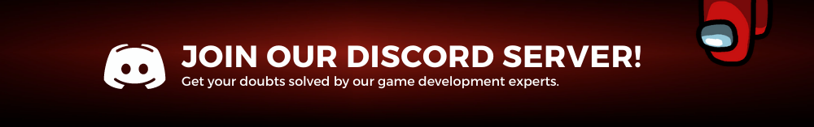

Triggers :

- In the above section we have talked about how we want to restrict the player from passing through the game object.
- In this part we will be talking about how to enable the player from passing through a game object. Basically it is done using “is trigger” checkbox in the collider component.

     

    
    
- When we check the “is trigger” component of a collider we disable the physics being applied to the component, which enables other game objects to pass through it still making it act as a collider.
- Triggers are mainly used for tutorials in games, in game collectables and also for level complete actions.

---

<aside>

> 💡 🚀 **[Join Discord Server](https://discord.gg/J5zDscnzms) → Get your doubts solved by experts instantly**

</aside>

---